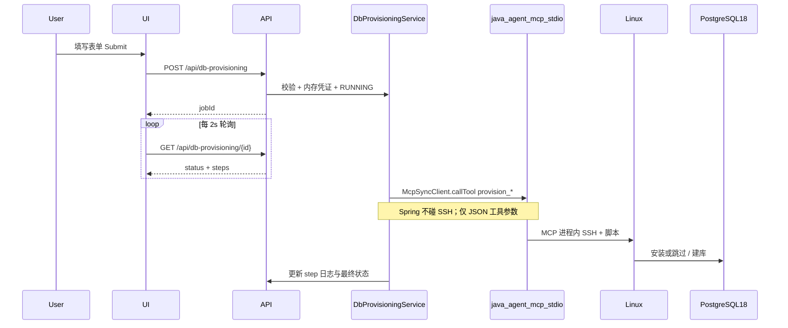

# java-agent-mvp：Create PG DB 功能 — Scope & Plan

## 1. 目标

在应用内提供 **DB Provisioning** 能力：用户通过 Web 表单指定 Linux 服务器与 PostgreSQL 配置，系统在远端 **按需安装 PostgreSQL 18**、**按需安装扩展**、创建数据库与 schema，并在 UI 中异步展示步骤日志。

与现有能力的关系：

- **Chat**：只读 MCP 查询 `emp` schema（不变）
- **DB Release**：设计文档 → SQL → 部署到 `emp_test`（不变）
- **DB Provisioning（新）**：在**用户提供的 Linux 主机**上准备 PG 18 实例与空库/schema

## 2. Scope

### In scope（v1）

| 模块 | 内容 |
|------|------|
| **UI 表单** | Linux host/IP、SSH port、账号；认证二选一（密码 / 私钥+可选 passphrase）；DB 内存与磁盘配置；database 名、schema 名；扩展多选 |
| **Idempotent 执行** | 已存在 PG 18 → 跳过安装；已存在 extension → `CREATE EXTENSION IF NOT EXISTS` 或跳过安装包步骤 |
| **异步 Job** | `POST` 创建请求 → `POST .../run` 后台执行 → 前端轮询 `GET .../{id}` |
| **持久化** | `db_agent` schema 新表存请求、步骤、日志、时间戳 |
| **执行通道** | **仅 MCP**：[`LazyProvisioningMcpClientFactory`](src/main/java/com/example/javaagentmvp/dbagent/LazyProvisioningMcpClientFactory.java) → **java-agent-mcp**（stdio）→ 内置 SSH 执行 `provision_*` 工具；**禁止** Spring 使用 JSch/MINA/`ProcessBuilder ssh` |
| **MCP 隔离** | Chat 继续用 [`mcp-servers-config.json`](src/main/resources/mcp-servers-config.json) 的 `@modelcontextprotocol/server-postgres`；Provisioning **单独进程**，不混入 Spring AI Chat 的 `McpSyncClient` 列表 |
| **OS 支持** | v1 文档化支持 **Ubuntu 22.04/24.04**、**RHEL 9 / Rocky 9**（PGDG 源）；其他发行版返回明确错误 |
| **扩展目录** | 见下文「扩展清单」 |
| **安全** | 密码/私钥仅用于当次 Job 内存传递，**禁止**写入 step 日志；SSH host key 策略可配置 |
| **Skill** | 项目级 [`.cursor/skills/db-provisioning/SKILL.md`](.cursor/skills/db-provisioning/SKILL.md)（实施阶段创建，全文见第 7 节） |

### Out of scope（v1）

- **Spring Boot 内嵌 SSH 客户端**（JSch、Apache MINA sshd、`ssh` 子进程均由 MCP 进程承担）
- 通过 Chat/LLM 工具循环驱动安装（Provisioning 为确定性 `callTool` 状态机，不走 `ChatClient`）
- 云厂商创建 VM（Linux 已存在）
- HA / 流复制 / 备份策略 / Prometheus 监控栈
- 修改 [`docker-compose.yml`](docker-compose.yml) 内嵌 Postgres 16
- 将 provisioning 目标自动注册进 `app.db-agent.targets`（可 v2）
- 生产级密钥库（Vault）；v1 用「不持久化密钥 + 可选仅保存 host/用户名」

### 已有 UI 占位（需接通）

- [`index.html`](src/main/resources/static/index.html)：`createDbProvisioningBtn`、`dbProvisioningSection`
- [`app.js`](src/main/resources/static/app.js)：`showToast("DB provisioning flow is not available yet")` → 改为打开 Modal

---

## 3. 表单字段（API / UI 一一对应）

### 3.1 Linux Server

| 字段 | 类型 | 校验 |
|------|------|------|
| `host` | string | 非空，hostname 或 IP |
| `sshPort` | int | 默认 22 |
| `sshUser` | string | 非空 |
| `authType` | `PASSWORD` \| `PRIVATE_KEY` | 必填 |
| `sshPassword` | string? | `PASSWORD` 时必填，响应/日志中永不返回 |
| `privateKeyPem` | string? | `PRIVATE_KEY` 时必填 |
| `privateKeyPassphrase` | string? | 可选 |

### 3.2 DB Server 配置

| 字段 | 类型 | 说明 |
|------|------|------|
| `memoryMb` | int | 用于生成 `shared_buffers`、`effective_cache_size` 等（按公式映射，见脚本） |
| `diskGb` | int | 预检查数据目录可用空间（`df`），不足则失败 |
| `dataDirectory` | string? | 可选，默认由 OS 包安装路径决定 |

### 3.3 Database

| 字段 | 类型 | 说明 |
|------|------|------|
| `databaseName` | string | PostgreSQL 标识符规则 `^[a-z_][a-z0-9_]*$` |
| `schemaName` | string | 库内 `CREATE SCHEMA IF NOT EXISTS` |
| `dbOwnerUser` | string? | 可选应用用户；默认 `databaseName + "_owner"` |
| `dbOwnerPassword` | string? | 可选；生成则仅在一次响应 `connectionHint` 中返回 |

### 3.4 Extensions（多选，idempotent）

| id | 显示名 | 行为 |
|----|--------|------|
| `pg_stat_statements` | DB metrics (pg_stat_statements) | 缺包则 OS 装 contrib；`CREATE EXTENSION IF NOT EXISTS` |
| `auto_explain` | Slow query log (auto_explain) | 写 `shared_preload_libraries` + reload |
| `pg_profile` | DB profile (pg_profile) | 需 PGDG/第三方包；已安装则只 `CREATE EXTENSION` |

---

## 4. 工作流与状态机



---

## 4.1 MCP 选型（确定方案）

### 选用：**java-agent-mcp**（专用 Provisioning MCP Server）

| 维度 | 说明 |
|------|------|
| **协议** | Model Context Protocol，stdio 传输（与现有 Chat Postgres MCP 相同模式） |
| **进程关系** | Spring 通过 `LazyProvisioningMcpClientFactory` 懒启动**独立子进程**；与 `spring.ai.mcp.client` 自动注册的 Chat MCP **解耦** |
| **SSH 位置** | SSH 连接、sudo、脚本执行全部在 **java-agent-mcp 进程内**（Node 推荐 `ssh2`，或 Java + sshd client） |
| **工具形态** | 暴露 **领域工具** `provision_*`，返回结构化 JSON（`status`, `skipped`, `majorVersion`, `logExcerpt`），供 `ProvisioningStepRunner` 判定 `SKIPPED` / `FAILED` |
| **脚本** | `scripts/provisioning/*.sh` 作为 MCP 包内资源，MCP 通过 SFTP/ heredoc 推到远端后执行，**不由 Spring 读文件或 scp** |

### 不采用（v1）

| 方案 | 不采用原因 |
|------|------------|
| Spring 直连 SSH | 用户明确要求禁止 |
| Chat 共用 Postgres MCP | 只读 SQL，无 SSH/安装能力 |
| 通用 [denysvitali/ssh-mcp](https://github.com/denysvitali/ssh-mcp) / [mcp-ssh-tool](https://github.com/oaslananka/mcp-ssh-tool) 作为主路径 | 偏「任意命令」或需人工确认；缺少 PG18/扩展 idempotent 语义；需在 Spring 侧拼 shell，安全边界弱 |
| 让 LLM 在对话里调用 SSH MCP | 不可审计、非确定性，与异步 Job 状态机冲突 |

> 若 java-agent-mcp 工期紧：可临时用 ssh-mcp 的 `ssh_execute` **仅**在 MCP 仓库内做适配层，但 **Spring 仍只 callTool**，不引入 SSH 依赖（见 5.4 备选）。

### java-agent-mcp 工具清单（v1 契约）

每次 `callTool` 均携带 **当次连接参数**（不落库）：`host`, `sshPort`, `sshUser`, `authType`, `password` 或 `privateKeyPem`, `passphrase`。

| Tool | 对应步骤 | 返回要点 |
|------|----------|----------|
| `provision_ping` | SSH_CONNECT | `{ ok, latencyMs }` |
| `provision_detect_os` | DETECT_OS | `{ osFamily: ubuntu\|rhel\|unsupported }` |
| `provision_check_pg18` | CHECK_PG_VERSION | `{ installed, majorVersion, skipped }` |
| `provision_install_pg18` | INSTALL_PG18 | `{ installed, skipped, logExcerpt }` |
| `provision_tune_memory` | TUNE_MEMORY | `{ memoryMb, applied }` |
| `provision_check_disk` | CHECK_DISK | `{ diskGb, availableGb, ok }` |
| `provision_create_database` | CREATE_DATABASE | `{ database, schema, owner, connectionHint }` |
| `provision_install_extension` | INSTALL_EXTENSIONS | `{ extension, skipped, installed }` |
| `provision_verify` | VERIFY_CONNECTION | `{ ok, serverVersion }` |

Idempotent 规则在 **MCP 实现内**与脚本双重保障：例如 `provision_check_pg18` 若 `majorVersion >= 18` 则 `skipped=true`，Spring 将步骤标为 `SKIPPED` 并跳过 `provision_install_pg18`。

### MCP 实现建议（java-agent-mcp 仓库）

- **运行时**：Node 20+（与 Dockerfile 中 Postgres MCP 一致，便于维护 `ssh2`）
- **SDK**：`@modelcontextprotocol/sdk`
- **打包**：`npm pack` 或 fat jar 产出可执行 `java-agent-mcp`（入口脚本在 `PATH` 或 `JAVA_AGENT_MCP_COMMAND`）
- **配置**：`STRICT_HOST_KEY_CHECKING`、`DEFAULT_TIMEOUT_SEC` 环境变量；**无**预置服务器密码（凭证仅来自 `callTool` 参数）

### Spring 侧调用方式（禁止 SSH）

```java
// ProvisioningMcpClient — 唯一远端执行入口
McpSyncClient client = lazyFactory.getClient();
CallToolResult result = client.callTool(
    new CallToolRequest("provision_check_pg18", Map.of(
        "host", host,
        "sshPort", port,
        // ... credentials from in-memory job context only
    )));
// Parse JSON content → ProvisioningStepOutcome
```

**不得**引入：`com.jcraft.jsch`, `org.apache.sshd`, `Runtime.exec("ssh ...")`。

### 请求状态

`PENDING` → `RUNNING` → `SUCCEEDED` | `FAILED` | `CANCELLED`

### 标准步骤（`provisioning_step.step_name`）

1. `VALIDATE_INPUT`
2. `SSH_CONNECT`
3. `DETECT_OS`
4. `CHECK_PG_VERSION` — 若 `psql/postgres` 主版本 ≥ 18 → `SKIPPED`
5. `INSTALL_PG18` — 否则 PGDG 安装 + init + enable systemd
6. `TUNE_MEMORY` — 根据 `memoryMb`  patch `postgresql.conf`
7. `CHECK_DISK` — `df` 与 `diskGb` 比较
8. `CREATE_DATABASE` — role + database + schema + grants
9. `INSTALL_EXTENSIONS` — 逐项 check/install（可拆子步骤日志）
10. `VERIFY_CONNECTION` — `psql` 连新库执行 `SELECT 1`
11. `COMPLETE`

每步状态：`PENDING` | `RUNNING` | `SUCCEEDED` | `SKIPPED` | `FAILED`

---

## 5. 技术实现计划

### 5.1 数据库（Flyway `V3__db_provisioning.sql`）

在 [`db_agent`](src/main/resources/db/migration/V2__db_agent_release.sql) 同级新增：

- `db_agent.provisioning_request`：id、title、host、ssh_user、auth_type（不含密钥）、database_name、schema_name、memory_mb、disk_gb、extensions（JSONB）、status、error_summary、connection_hint（成功后一次性）、created_at、updated_at
- `db_agent.provisioning_step`：request_id、step_name、status、log_text（脱敏）、started_at、finished_at、sort_order

**不存** ssh 密码、私钥、db 密码明文。

### 5.2 配置（双 MCP 通道）

| 通道 | 配置位置 | MCP Server | 用途 |
|------|----------|------------|------|
| Chat 只读 | `spring.ai.mcp.client.stdio.servers-configuration` → [`mcp-servers-config.json`](src/main/resources/mcp-servers-config.json) | `@modelcontextprotocol/server-postgres` | 对话 SQL |
| Provisioning | `app.db-agent.provisioning-mcp-command` + [`LazyProvisioningMcpClientFactory`](src/main/java/com/example/javaagentmvp/dbagent/LazyProvisioningMcpClientFactory.java) | **java-agent-mcp** | Create PG DB Job |

扩展 [`DbAgentProperties`](src/main/java/com/example/javaagentmvp/dbagent/DbAgentProperties.java)（当前 factory 已引用但 record 未声明，需补齐）：

```yaml
app:
  db-agent:
    provisioning-mcp-command: ${JAVA_AGENT_MCP_COMMAND:java-agent-mcp}
    provisioning-mcp-args: []   # 例如 ["--strict-host-keys"]
    provisioning-timeout-seconds: 600
    provisioning-poll-interval-ms: 2000
```

**不**在 `mcp-servers-config.json` 中注册 java-agent-mcp，避免被 Spring AI 自动注入 Chat 的 `List<McpSyncClient>`。

### 5.3 后端包结构

```
com.example.javaagentmvp.dbagent.provisioning/
  DbProvisioningController.java      # REST
  DbProvisioningService.java         # 创建/查询/触发 run
  ProvisioningJobExecutor.java       # @Async 执行
  ProvisioningMcpClient.java         # 封装 callTool + JSON 解析
  ProvisioningStepRunner.java        # 状态机 → 调用 ProvisioningMcpClient
  ProvisioningRequestValidator.java
  ProvisioningLogRedactor.java
  model/ProvisioningRequestRow.java
  model/ProvisioningStepRow.java
  persistence/ProvisioningMapper.java + XML
```

**REST API（建议）**

| Method | Path | 说明 |
|--------|------|------|
| GET | `/api/db-provisioning` | 列表（sidebar） |
| GET | `/api/db-provisioning/{id}` | 详情 + steps |
| POST | `/api/db-provisioning` | 创建（body 含密钥，服务端不落库） |
| POST | `/api/db-provisioning/{id}/run` | 启动异步（body 再次带密钥或 session token — v1 简化为创建时缓存于内存 ConcurrentHashMap，TTL 15min） |
| POST | `/api/db-provisioning/{id}/cancel` | 可选，尽力取消 |

> v1 简化：**创建 + run 合并为单次 POST**：创建记录同时将 credentials 交给 `ProvisioningJobExecutor` 内存队列，避免密钥落库。前端一次 Submit 即可。

推荐合并 API：

- `POST /api/db-provisioning` → 创建并立即 `RUNNING`，返回 `{ id, status }`
- `GET /api/db-provisioning/{id}` → 轮询

### 5.4 MCP 与脚本契约

**仓库分工**

| 仓库 | 职责 |
|------|------|
| **java-agent-mcp**（独立，建议与 mvp 同级目录 `../java-agent-mcp`） | MCP Server、`provision_*` tools、内置 SSH、打包脚本 |
| **java-agent-mvp** | UI/API/Job 状态机、`ProvisioningMcpClient.callTool`、Flyway、[`scripts/provisioning/`](scripts/provisioning/) 脚本源（由 MCP build 复制或 git submodule） |

脚本清单（由 **java-agent-mcp** 在远端执行，非 Spring）：

| 脚本 | 作用 |
|------|------|
| `detect_os.sh` | 输出 `ubuntu` / `rhel` / `unsupported` |
| `check_pg18.sh` | 已安装则 `installed=true` |
| `install_pg18_ubuntu.sh` / `install_pg18_rhel.sh` | PGDG 安装 |
| `tune_memory.sh` | `MEMORY_MB` |
| `check_disk.sh` | `DISK_GB`、`DATA_DIR` |
| `create_db.sh` | `DB_NAME`、`SCHEMA_NAME`、`OWNER` |
| `install_extension.sh` | `EXT_NAME` |

**备选（仅开发联调）**：临时在 java-agent-mcp 内嵌调用 [denysvitali/ssh-mcp](https://github.com/denysvitali/ssh-mcp) 的 `ssh_connect`/`ssh_execute` 作为传输层，对外仍暴露 `provision_*` 工具；**Spring 永远只认 `provision_*`**。

### 5.5 前端

新增 [`provisioning.js`](src/main/resources/static/provisioning.js)（仿 [`releases.js`](src/main/resources/static/releases.js)）：

- Modal：`#provisioningModal`（host、ssh、auth 切换、memory/disk、db/schema、extension checkboxes）
- Workspace：`#provisioningView`（步骤 pipeline + 日志折叠）
- `showView("db-provisioning")` 与 sidebar 联动
- `RUNNING` 时 `setInterval` 轮询，结束清除

样式复用 [`styles.css`](src/main/resources/static/styles.css) 中 modal / release-workflow 类。

### 5.6 测试

- `ProvisioningRequestValidatorTest`：标识符、端口、memory/disk 范围
- `ProvisioningLogRedactorTest`：密码、PEM 不出现在 log
- `ProvisioningStepRunnerTest`：mock MCP，断言 `SKIPPED` 分支
- 手动：对 disposable VM 跑通全流程

---

## 6. 风险与依赖

| 风险 | 缓解 |
|------|------|
| `DbAgentProperties` 与 `LazyProvisioningMcpClientFactory` 字段不一致 | 实施时补齐 record 字段，保证编译通过 |
| java-agent-mcp 未安装 | 启动时不 eager load；Run 时 fail-fast 友好错误（提示 `JAVA_AGENT_MCP_COMMAND`） |
| 误用 Spring SSH | Code review 禁止 jsch/sshd 依赖；Provisioning 包仅依赖 `io.modelcontextprotocol` client |
| 远端 sudo 权限不足 | 步骤 `INSTALL_PG18` 失败并提示需要 root/sudo |
| `pg_profile` 非所有 OS 仓库可用 | UI 标注「RHEL/Ubuntu PGDG」；失败时 step 级 FAILED 不阻断库创建（可配置 strict 模式） |
| 密钥传输 | HTTPS 部署；v1 不持久化；日志脱敏 |

---

## 7. Skill 草案（实施时写入 `.cursor/skills/db-provisioning/SKILL.md`）

```markdown
---
name: db-provisioning
description: >-
  Implement or debug java-agent-mvp DB Provisioning: form-driven async jobs
  that install PostgreSQL 18 on Linux via java-agent-mcp (MCP-only, no Spring SSH),
  create database/schema, and install extensions idempotently. Use when adding
  provisioning UI, API, Flyway, java-agent-mcp tools, or fixing provisioning failures.
---

# DB Provisioning (java-agent-mvp)

## When to use

- User asks for "Create PG DB", "DB Provisioning", "install PostgreSQL 18 on Linux server"
- Editing provisioning UI (`index.html`, `provisioning.js`), API (`DbProvisioningController`), or Flyway `V3__db_provisioning.sql`
- Implementing or debugging **java-agent-mcp** `provision_*` tools
- Debugging failed provisioning steps

## Architecture

- **UI**: Sidebar "New DB Provisioning" → modal form → workspace with step pipeline + logs
- **API**: `POST /api/db-provisioning` (create+run async), `GET /api/db-provisioning/{id}` (poll)
- **Persistence**: `db_agent.provisioning_request`, `db_agent.provisioning_step` — never store SSH/DB passwords
- **Execution (MCP-only)**:
  - `ProvisioningMcpClient` → `LazyProvisioningMcpClientFactory` → **java-agent-mcp** (stdio)
  - java-agent-mcp 内部 SSH → 远端 Linux → `scripts/provisioning/*.sh`
  - **Never** add JSch/sshd/`ssh` CLI in Spring Boot
- **Chat MCP (separate)**: `@modelcontextprotocol/server-postgres` in `mcp-servers-config.json` — not used for provisioning

## Idempotency rules

1. **PostgreSQL 18**: Run `check_pg18.sh`. If major version >= 18, mark step `CHECK_PG_VERSION` and `INSTALL_PG18` as `SKIPPED`.
2. **Extensions**: For each selected extension, if `pg_available_extensions` contains it and `CREATE EXTENSION IF NOT EXISTS` succeeds, skip package install.
3. **Database/schema**: Use `CREATE DATABASE` only when missing; always `CREATE SCHEMA IF NOT EXISTS`.

## Form fields (must match API)

- Linux: host, sshPort (default 22), sshUser, authType (PASSWORD|PRIVATE_KEY), sshPassword or privateKeyPem (+ optional passphrase)
- DB server: memoryMb, diskGb, optional dataDirectory
- DB: databaseName, schemaName, optional dbOwnerUser/dbOwnerPassword
- extensions: array of `pg_stat_statements` | `auto_explain` | `pg_profile`

## Standard steps (order)

VALIDATE_INPUT → SSH_CONNECT → DETECT_OS → CHECK_PG_VERSION → INSTALL_PG18 → TUNE_MEMORY → CHECK_DISK → CREATE_DATABASE → INSTALL_EXTENSIONS → VERIFY_CONNECTION → COMPLETE

## Security (mandatory)

- Redact passwords, PEM, and connection strings from `provisioning_step.log_text` via `ProvisioningLogRedactor`
- Do not add secrets to Flyway tables or application logs
- Credentials only in memory for active job; prefer single POST create+run

## Key files

| Area | Path |
|------|------|
| UI shell | `src/main/resources/static/index.html` |
| UI logic | `src/main/resources/static/provisioning.js` |
| MCP factory | `src/main/java/.../LazyProvisioningMcpClientFactory.java` |
| Scripts | `scripts/provisioning/*.sh` |
| Migrations | `src/main/resources/db/migration/V3__db_provisioning.sql` |
| Release pattern | `ReleaseController.java`, `releases.js` |

## OS support (v1)

- Ubuntu 22.04/24.04: PGDG apt repo, package `postgresql-18`
- RHEL 9 / Rocky 9: PGDG yum, `postgresql18-server`
- Other: fail at `DETECT_OS` with clear message

## MCP contract (java-agent-mcp)

Spring calls only these tools: `provision_ping`, `provision_detect_os`, `provision_check_pg18`, `provision_install_pg18`, `provision_tune_memory`, `provision_check_disk`, `provision_create_database`, `provision_install_extension`, `provision_verify`.

Each tool accepts per-job SSH credentials in arguments (not stored on disk). Returns JSON with `skipped` where applicable.

Implement java-agent-mcp before wiring UI end-to-end. Do not use generic ssh-mcp from Spring; do not use Spring SSH libraries.

## Testing checklist

- [ ] Validator rejects invalid identifiers
- [ ] Mock MCP: install step SKIPPED when check returns installed
- [ ] Logs contain no password substrings
- [ ] Manual run on Ubuntu VM: form → SUCCEEDED → connection hint returned once
```

---

## 8. 实施顺序（推荐）

1. **java-agent-mcp**：stdio MCP + `provision_*` 工具 + 内置 SSH + 打包 `scripts/provisioning/*.sh`  
2. Flyway V3 + MyBatis mapper（java-agent-mvp）  
3. 补齐 `DbAgentProperties` + `ProvisioningMcpClient` + `LazyProvisioningMcpClientFactory`  
4. `ProvisioningStepRunner` 状态机（仅 `callTool`，集成测试 mock MCP）  
5. `DbProvisioningController` + 异步 Executor  
6. UI Modal + `provisioning.js` + 轮询  
7. `.cursor/skills/db-provisioning/SKILL.md`（复制第 7 节）  
8. README：双 MCP 说明、安装 `java-agent-mcp`、`JAVA_AGENT_MCP_COMMAND`、禁止 Spring SSH

---

## 9. 与先前「独立 Linux PG18」计划的区别

先前计划面向**手工**在服务器装 PG；本需求是 **应用内产品功能**，通过 MCP 代理执行、表单驱动、异步可观测，且与 java-agent-mvp 的 `db_agent` 元数据共存。
