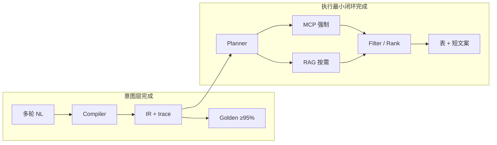

# 竞品级 Checklist：意图层 + Chat 多轮执行最小闭环

**前提**

- **Chat** 是唯一主入口；**多轮对话**是默认用法。
- **意图层**是核心差异化；**数据层**可渐进完善（本清单不涉及数据采集）。
- **完成定义**：多轮 Chat 下 IR 稳定可测；每条 IR 在 Chat 中经 Planner → MCP/RAG → 过滤 → 表驱动回答，澄清后可续跑。



---

## 里程碑

| 里程碑 | 含义 | 门禁 |
|--------|------|------|
| **意图层 v1** | IR 契约 + 多轮 merge + Golden CI | `constraint_compile*.jsonl` ≥95% |
| **意图层 v1.5** | 约束卡片、澄清结构化、理解纠错 | 内测可演示 |
| **执行闭环 v1** | Chat IR 驱动 MCP/RAG，8 条 E2E 全过 | 见 [E2E 最小闭环](#六chat-多轮-e2e-最小闭环) |
| **竞品可对标** | 上两项 + 延迟/稳定性 + 约束可编辑 | 另立非功能指标 |

**Golden 用例**

- 单轮 / 简单多轮：`admission-compiler/eval/cases/constraint_compile.jsonl`
- **多轮 / 澄清续跑 / 对抗**：[`eval/cases/constraint_compile_multiturn.jsonl`](../eval/cases/constraint_compile_multiturn.jsonl)

```bash
# Python 编译器（规则 + 本体，无 LLM）
cd admission-compiler && .venv/bin/python eval/run_eval.py

# 多轮集（Java 默认 surefire；跳过 status=target）
# mvn test -Dtest=ConstraintCompileMultiturnEvalTest
# Python 编译器（规则 + 本体，无 LLM）
cd admission-compiler && .venv/bin/python eval/run_eval.py --cases ../eval/cases/constraint_compile_multiturn.jsonl
```

---

## 一、意图层

### 1. IR 契约（单一真相）

| ID | 项 | 完成标准 | 验收 |
|----|-----|---------|------|
| I-1 | 统一 Schema | Chat / Workflow / 评测共用 `AdmissionQueryIr` | 无第二套并行模型 |
| I-2 | 任务枚举稳定 | `search_majors` / `search_rank` / `policy_qa` / `report` / `unknown` 有文档 | 半年内不大改 |
| I-3 | 槽位完备 | score、provinces[]、subject_group、year、admission_type | 多轮 merge 单测 |
| I-4 | 硬约束完备 | exclude/include school & major | 长三角+不当老师 case |
| I-5 | 软约束完备 | preferences[]（dimension + weight + raw_phrase） | 三偏好句 case |
| I-6 | 区域本体 | 长三角、东北等 → provinces[]（YAML） | 改词表不改代码 |
| I-7 | 排除本体 | 不当老师、不要师范等 → filters（YAML） | 同上 |
| I-8 | 澄清项枚举 | score / subject_group / provinces 与 `blocksMcpExecution()` 一致 | 缺项必进 needs_clarification |

**代码锚点**：`AdmissionQueryIr.java`，`src/main/resources/admission-ontology/*.yaml`（Java / Python compiler 共用）

---

### 2. 编译器（NL → IR）

| ID | 项 | 完成标准 | 验收 |
|----|-----|---------|------|
| I-9 | 唯一 Compiler 入口 | 全站经 `AdmissionQueryCompileService.compile(message, priorMessages)` | Chat 无旁路分类器 |
| I-10 | 多轮 merge | 当前句 + prior messages + slots → 合并；地理/任务切换有规则 | multiturn jsonl 全绿 |
| I-11 | Delta 可追踪 | 本轮变更字段可标识 | `parse_trace.inherited_from_prior` + `MultiturnIntentSupport` |
| I-12 | L1 规则 | 分数、位次、政策、明确省份 | 高频无 LLM |
| I-13 | L2 本体 | 区域 / 排除 / 偏好短语 | ontology 单测 |
| I-14 | L3 LLM | 仅 unknown / 低 confidence；schema 校验；失败 fallback | 可选，长尾 |
| I-15 | 远程/本地一致 | Python `admission-compiler` 与 Java local compiler 同 schema、同 golden | 双端同 jsonl |

**代码锚点**：`AdmissionQueryCompileService`，`LocalAdmissionQueryCompiler`，`admission-compiler/`

---

### 3. 多轮对话（Chat 基本用法）

| ID | 项 | 完成标准 | 验收 |
|----|-----|---------|------|
| I-16 | 历史来源统一 | 从 `chat_memory` 取 prior user messages | 与 UI 一致 |
| I-17 | 继承补槽 | 「那浙江呢？」→ 保留 score、subject_group，更新 provinces | multiturn case |
| I-18 | 任务切换 | 「招生章程呢？」→ policy，不沿用 MCP 分数表 | multiturn case |
| I-19 | 地理覆盖 | 「东北的排名」→ 替换长三角，不叠加 | `LocalAdmissionQueryCompilerTest` |
| I-20 | 澄清续跑 | 轮1 缺分追问 → 轮2 补分 → 合并 IR 并执行 | E2E-3、E2E-5 |
| I-21 | Sticky 不僵死 | 默认继承；明确换话题可打断 | 对抗 case |

**代码锚点**：`AdmissionQueryAdvisor`，`ForcedMcpAdvisor`，`AdmissionQueryMcpExecutor`，`CompileQueryNode`，`ConversationPriorUserMessagesResolver`，`MultiturnIntentSupport`，`UserTurnContextExtractor`，`AdmissionQueryContext`

---

### 4. 可测、可迭代

| ID | 项 | 完成标准 | 验收 |
|----|-----|---------|------|
| I-22 | Golden set | ≥50 条：区域、排除、偏好、多轮、澄清、对抗 | CI 必跑 |
| I-23 | 通过率 | 编译准确率 ≥95% | CI 报表 |
| I-24 | 回归 | 改 ontology/prompt 必跑全量 | PR 阻断 |
| I-25 | parse_trace | rules / ontology / llm 来源 | 线上可审计 |
| I-26 | 置信度策略 | 低 confidence → 澄清或确认 | 产品规则写死 |

---

### 5. 产品层意图暴露

| ID | 项 | 完成标准 | 验收 |
|----|-----|---------|------|
| I-27 | 约束卡片 | 展示省份、分、科类、排除、偏好 | UI 或 debug |
| I-28 | 澄清话术结构化 | 由 `needs_clarification` 生成 | 同缺项同话术 |
| I-29 | 理解纠错 | 「不是师范是理工」→ IR 更新 | ≥1 case |

---

## 二、执行层最小闭环（Chat 多轮）

**原则**：Chat 主路径 = **IR → Planner → 强制 MCP/RAG → 确定性过滤 → LLM 只写说明**。

### 1. 规划

| ID | 项 | 完成标准 | 验收 |
|----|-----|---------|------|
| E-1 | Planner 唯一 | Chat 与 Workflow 共用 `QueryPlanner` | 无两套计划 |
| E-2 | 计划可序列化 | mcp_calls[]、rag_queries[]、filters、rank_preferences | 日志可 replay |
| E-3 | 缺槽不执行 | `blocksMcpExecution()` → 不调 MCP | 无空参 MCP |
| E-4 | 多省展开 | provinces=[苏,浙,沪] → N 次 getMajorByScore + merge | 与 IR 一致 |
| E-5 | rank 多省 | 多省 rank 或文档声明仅单省 + 澄清 | 行为明确 |

---

### 2. MCP（硬数据）

| ID | 项 | 完成标准 | 验收 |
|----|-----|---------|------|
| E-6 | 参数来自 IR | slots 为准，LLM 传参可校正 | `McpTableCapturingToolCallback` |
| E-7 | 强制调用 | search_majors/rank 必须有 tool 结果才出推荐表 | 无 tool 不编造 |
| E-8 | 冲稳保确定性 | Java 分档 | 同分同结果 |
| E-9 | 排除过滤 | exclude 师范 → 表计数一致 | count 可对比 |

---

### 3. RAG

| ID | 项 | 完成标准 | 验收 |
|----|-----|---------|------|
| E-10 | policy 走 RAG | policy_qa/report 政策必检索 | sources 或明确未命中 |
| E-11 | preference 走 RAG | preferences 非空 → 检索链路执行 | retrievalQuery 来自 IR |
| E-12 | RAG 不替代 MCP 分 | 有分数时专业列表来自 MCP | 路由不变 |

---

### 4. 过滤与排序

| ID | 项 | 完成标准 | 验收 |
|----|-----|---------|------|
| E-13 | QueryConstraints | Chat 必走 `MajorScoreFilter` | 与 Workflow 同结果 |
| E-14 | 偏好排序 | preferences → `PreferenceRanker` | 顺序可 diff |
| E-15 | 表与 IR 一致 | 表省份 ⊆ IR.provinces；无 excluded 项 | 自动断言 |

---

### 5. 回答生成

| ID | 项 | 完成标准 | 验收 |
|----|-----|---------|------|
| E-16 | LLM 角色收窄 | 导语 + 解释；不生成录取分/位次 | prompt + 抽检 |
| E-17 | 表格来自 tool | UI 表 = MCP JSON 经 Filter | `McpTableExtractor` |
| E-18 | 澄清优先 | needs_clarification 非空 → 无假推荐 | 短路保持 |
| E-19 | 多轮状态 | 会话可重建上一轮 IR | 澄清续跑不丢约束 |
| E-20 | 失败可解释 | MCP 空 / 全过滤 → 原因 + 可改约束 | 非泛泛暂无 |

---

## 三、与当前 `ir` 分支对照（滚动更新）

| 项 | 状态 | ID |
|----|------|-----|
| IR Schema + 本地编译复杂句 | ✅ | I-1～I-8 |
| Chat 多轮 compile（IR 唯一入口） | ✅ | I-9、I-16 |
| Intent legacy 收敛（无 ResolvedTurn / 双 classifier） | ✅ | I-9 |
| 澄清短路 | ✅ | E-3、E-18 |
| Java multiturn golden（`ConstraintCompileMultiturnEvalTest`） | ✅ | I-22、I-23 |
| MCP 多省 + 排除（Workflow；Chat 事后过滤） | ⚠️ | E-4、E-9、E-13 |
| Chat 强制 Planner+MCP（ForcedMcpAdvisor + IR 预执行） | ✅ | E-6、E-7、E-16 |
| Workflow 多轮 compile（chat_memory → CompileQueryNode） | ✅ | I-10、I-20 |
| rank 多省（Chat fan-out + Workflow ScoreToolNode 多省 merge） | ✅ | E-5 |
| 约束卡片 UI | ❌ | I-27 |
| 文案与表一致 | ⚠️ | E-17、E2E-7 |

---

## 四、实施顺序

1. **I-22～I-26**：golden + CI（`constraint_compile` + `constraint_compile_multiturn`）
2. **I-9～I-21**：多轮 merge 规则锁死
3. **E-1～E-7**：Chat 改为 IR → Planner → **强制** MCP
4. **E-13～E-15 + E2E-3～E-5**：澄清续跑 + 过滤一致
5. **I-27 + E-16～E-17**：约束卡片 + 表驱动回答
6. **E-5、I-18、E2E-6～E-8**：边角与对抗

---

## 五、JSONL 用例 Schema

### 单步编译（与 `constraint_compile.jsonl` 相同）

```json
{
  "id": "followup-province",
  "input": "那浙江呢？",
  "prior_user_messages": ["安徽物理类620分能上什么专业"],
  "prior_slots": { "score": 620, "provinces": ["安徽"], "subject_group": "物理类" },
  "expect": {
    "task": "search_majors",
    "score": 620,
    "provinces": ["浙江"],
    "subject_group": "物理类",
    "needs_clarification": []
  }
}
```

### 多轮场景（`constraint_compile_multiturn.jsonl`）

```json
{
  "id": "clarify-then-score",
  "description": "轮1 缺分澄清，轮2 补槽后续跑",
  "turns": [
    {
      "input": "我要报考长三角的大学，不当老师",
      "expect": {
        "task": "search_majors",
        "provinces": ["江苏", "浙江", "上海"],
        "exclude_school": ["师范"],
        "needs_clarification": ["score", "subject_group"],
        "blocks_mcp": true
      }
    },
    {
      "input": "620分，物理类",
      "prior_user_messages": ["我要报考长三角的大学，不当老师"],
      "expect": {
        "task": "search_majors",
        "score": 620,
        "subject_group": "物理类",
        "provinces": ["江苏", "浙江", "上海"],
        "exclude_school": ["师范"],
        "needs_clarification": [],
        "blocks_mcp": false
      }
    }
  ]
}
```

**expect 字段**

| 字段 | 说明 |
|------|------|
| `task` | `search_majors` / `search_rank` / `policy_qa` / `report` / `unknown` |
| `score` | 整数 |
| `subject_group` | 如 `物理类` |
| `provinces` | 字符串数组；`provinces_exact: true` 时要求完全一致 |
| `exclude_school` / `exclude_major` | 子串须出现在 filters 中 |
| `preferences` | `employment_outlook` / `salary` / `state_owned_employability` |
| `needs_clarification` | 与 IR 完全一致（含空数组） |
| `blocks_mcp` | 是否应阻止 MCP 执行（可选，执行层 E2E 用） |
| `status` | `target` = 竞品级目标行为，默认 eval 跳过；实现后删除或改 `current` |

**运行**

```bash
# 当前应通过的用例（默认跳过 status=target）
cd admission-compiler && .venv/bin/python eval/run_eval.py --cases ../eval/cases/constraint_compile_multiturn.jsonl

# 含目标用例（允许失败，用于驱动开发）
cd admission-compiler && .venv/bin/python eval/run_eval.py --cases ../eval/cases/constraint_compile_multiturn.jsonl --include-target
```

---

## 六、Chat 多轮 E2E 最小闭环

以下 **8 条全过** = 执行层最小闭环完成（不要求就业数据完美）。

| ID | 场景 | 通过标准 |
|----|------|---------|
| E2E-1 | 单轮：安徽620物理能上什么 | 调 MCP；安徽专业表；冲稳保 |
| E2E-2 | 单轮：长三角不当老师（缺分） | 只澄清；不调 MCP |
| E2E-3 | 澄清续跑：补「620分物理类」 | 合并 IR；三省；排除师范；出表 |
| E2E-4 | 620安徽物理 → 那浙江呢？ | 保留分科类；更新省；再查 |
| E2E-5 | 长三角+三偏好 → 补分科类 | preferences 保留；有过滤+RAG 记录 |
| E2E-6 | 查分 → 合工大招生章程 | policy + RAG；无冲稳保表 |
| E2E-7 | 表已排除师范，文案不推师范 | 文案与表一致 |
| E2E-8 | 同会话同输入 | IR 可复现（trace 可查） |

对应用例 ID 见 `eval/cases/constraint_compile_multiturn.jsonl` 中带 `"e2e": "E2E-n"` 的条目。

---

## 七、一句话

**意图层完成** = 多轮 Chat 下 IR 稳定、可测、全站唯一。  
**执行最小闭环完成** = 每条 IR 在 Chat 里 **Planner → MCP/RAG → 过滤 → 表**，澄清后能续跑，**表与约束一致**——不靠模型猜该查什么。
